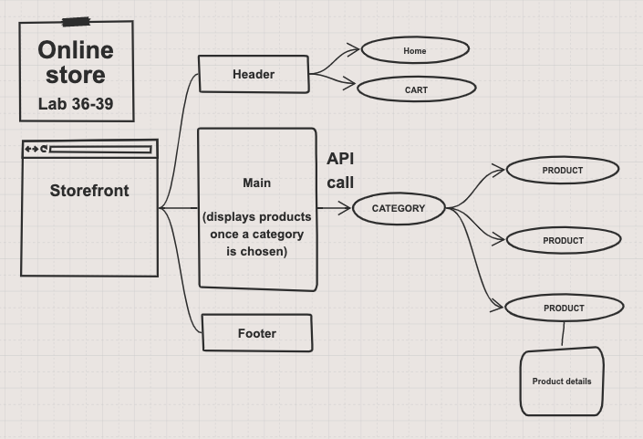

# Virtual Storefront

## Version
0.3.0

## Author
- Tia Low

### About
Full-stack JavaScript developer with a diverse background of personal and professional experience.
- [Linkedin](https://www.linkedin.com/in/tia-low/)

## Build-Out Description

### **Phase 1: Application Setup**
- Basic React Application
- Redux State Management
- State managed in memory
- Material UI Components & Styling

### **Phase 2: Shopping Cart**
- Add items to a shopping cart
- Update quantities
- Remove items from the cart (stretch)
- Show the cart in real-time on the UI

### **Phase 3: Live Data**
- Connect the application a live API
- Persist changes to products based on cart activity.

## UML

